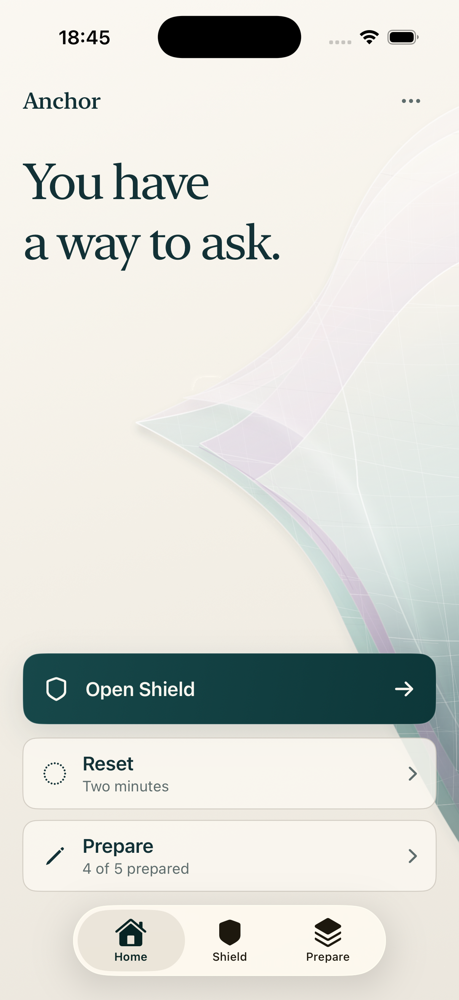
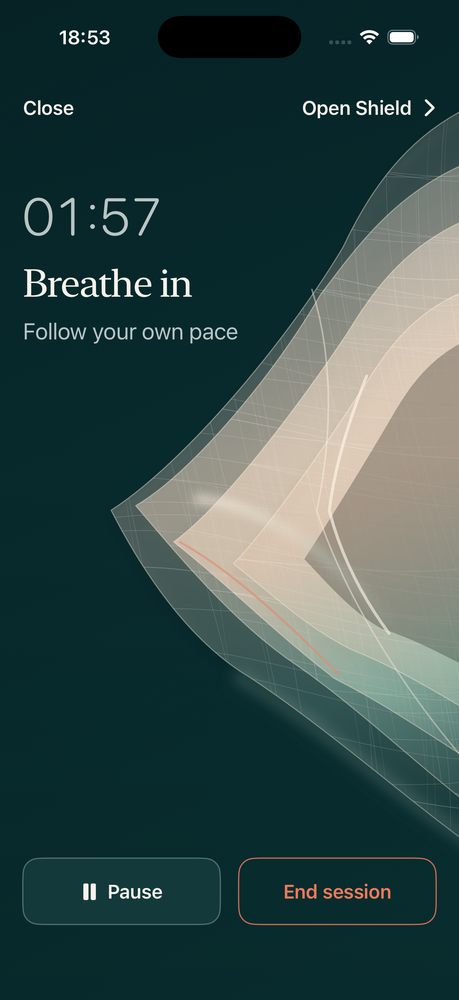
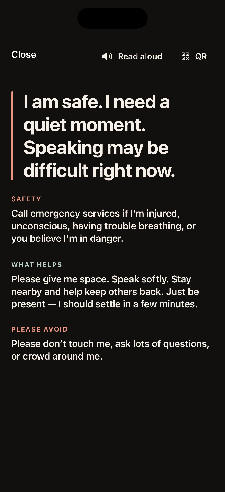
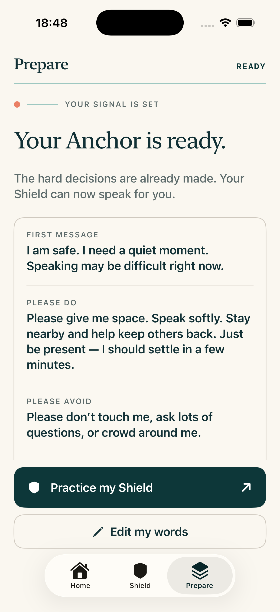
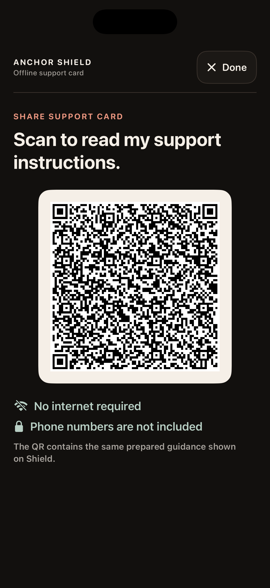
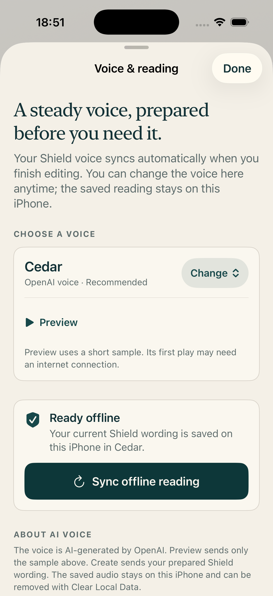

# Anchor

<p align="center">
  
</p>

Anchor was born as a submission project for Apple's Swift Student Challenge (SSC) 2026 and was later strengthened during OpenAI Build Week on Devpost. The Build Week iteration deepens the original idea with a more complete preparation flow, a deterministic emergency Shield, and a calmer, more accessible product experience.

It explores a social issue: how technology can support people who may struggle to communicate, make decisions, or ask for help during panic, anxiety, stress, or emotional overwhelm.

The core idea is simple:

> In a hard moment, people should not be forced to make complex decisions.  
> The app should help them prepare before the moment comes.

Anchor focuses on preparation, low-friction access, and calm interaction design rather than forcing users to navigate many screens during an overwhelming moment.

---

## Screenshots

<table>
  <tr>
    <td align="center">
      
    </td>
    <td align="center">
      
    </td>
    <td align="center">
      
    </td>
    <td align="center">
      
    </td>
  </tr>
  <tr>
    <td align="center"><b>Home</b></td>
    <td align="center"><b>Reset</b></td>
    <td align="center"><b>Shield</b></td>
    <td align="center"><b>Prepare</b></td>
  </tr>
</table>

Additional current states captured from the same iPhone 17 Pro Simulator build:

<table>
  <tr>
    <td align="center">
      
    </td>
    <td align="center">
      
    </td>
  </tr>
  <tr>
    <td align="center"><b>Shield QR</b></td>
    <td align="center"><b>Voice &amp; reading</b></td>
  </tr>
</table>

---

## Overview

Anchor is a SwiftUI-based iPhone app created from an Apple Swift Student Challenge 2026 project.

The project explores how digital tools can support people who may struggle to make calm decisions, explain their needs, or ask for help during high-stress moments.

Instead of treating the phone as something the user must actively operate while overwhelmed, Anchor is designed around the idea that important decisions and support flows should be prepared in advance.

The current Build Week experience includes:

- A Human Signal home screen with one dominant Shield action
- A two-minute, breath-synchronized Reset with a motion-free fallback
- A static, high-contrast Shield that remains independent from decorative motion
- One-question-at-a-time preparation for a complete support card
- Offline QR sharing and manual multi-contact Support Relay
- A selectable OpenAI voice that syncs when preparation is finished and is saved for offline Shield reading
- A dismissible, private aftercare check-in

---

## Background

Anchor began from a personal experience involving the creator's mother and was first shaped through Apple's Swift Student Challenge (SSC) 2026.

During OpenAI Build Week on Devpost, the project was expanded and refined around the same core question: how can technology help someone communicate when speaking, deciding, or asking for help becomes difficult?

That experience led to a broader question:

> What if a person needs help, but cannot calmly explain what they need in the moment?

During panic, anxiety, stress, or emotional overwhelm, people may have difficulty speaking clearly, choosing the right action, or communicating their support needs. Even when someone nearby wants to help, the person in distress may not be able to explain their situation.

Anchor was created to explore this social issue through an iPhone app.

The goal of this project is not to present a medical or emergency product, but to explore how technology can reduce cognitive load and support communication in high-stress situations.

---

## Problem

When people experience panic, anxiety, stress, or emotional overwhelm, even simple actions can become difficult.

Common problems include:

- Difficulty deciding what to do next
- Difficulty communicating personal needs
- High cognitive load from complex interfaces
- Trouble explaining the situation to others
- Emotional pressure caused by visual noise or too many choices
- Difficulty accessing prepared support information quickly

Anchor was designed with the assumption that the user may not be able to calmly operate the app during the most difficult moment.

Therefore, the app emphasizes preparation, clarity, and minimal interaction.

---

## Design Philosophy

Anchor is based on three design principles.

### 1. Prepare before the hard moment

The app should help users prepare important information, support messages, and access flows before an urgent moment happens.

### 2. Reduce cognitive load

During emotional overwhelm, the interface should be simple, calm, and predictable.

### 3. Support communication

The app should help users communicate essential information to others when speaking or explaining may be difficult.

---

## Key Features

### Home

The home screen acts as a calm starting point where users can quickly understand their
available options. Its **Human Signal** background is a native Canvas membrane made
from layered, translucent folds and an intentionally slow 32-second drift. The visual
field responds subtly to the Shield button without competing with the primary action;
Reduce Motion presents the same composition as a deterministic still image.

### Breathing

The two-minute Reset provides a simple guided experience to help users slow down and
regain a sense of rhythm. Its dark Human Signal membrane opens and returns with the
eight-second breathing clock, freezes while paused, becomes a stable still with Reduce
Motion, and never carries into Shield.

### Shield

The Shield feature allows users to prepare important support information in advance.

Prepared information can be displayed clearly during a hard moment and can also be shared through QR-based communication so that others can understand what kind of support may be helpful.

### Prepare

Prepare asks one concrete question at a time and saves the existing local `ShieldConfig`.
The final review shows the support card at realistic reading density and offers practice
or editing without exposing a complex advanced editor.

### Support Relay

The person can add multiple trusted contacts in an intentional order. Shield presents
one contact at a time, keeps **Next contact** separate from **Call**, and never cycles or
calls automatically.

### Aftercare

Aftercare is an optional Home sheet, not a tab or required task. A person can record a
simple body state and one optional sentence locally, close without saving, or return
directly to Shield.

### Safety boundary

Shield performs no AI generation, network request, automatic decision, or decorative
animation. OpenAI speech is generated from the calm-state preparation flow when the
person finishes editing, then saved locally; changing the selected voice also refreshes
the saved reading. Shield plays that prepared AAC file without making a request and
falls back immediately to the iOS device voice if no file is ready. Prepared instructions
and QR remain available offline; phone numbers are not included in the QR payload.

---

## Tech Stack

- Swift
- SwiftUI
- Swift Package Manager
- Native SwiftUI Canvas rendering for the Human Signal Home membrane and Tidal Reset motion
- OpenAI `gpt-4o-mini-tts` speech through a key-isolating Node VoiceProxy; Whisper is not used because it transcribes speech instead of generating it
- Local AAC caching for deterministic, offline Shield playback
- Editable Rive authoring assets and a dormant bridge for future reviewed `.riv` exports;
  the shipping target stays native-only until an actual runtime asset is bundled
- Xcode / Swift Playgrounds
- Local data handling
- QR code generation
- iOS system integrations

---

## Project Structure

```text
Anchor-BuildWeek.swiftpm
├── App
│   ├── AppRouter.swift
│   ├── ContentView.swift
│   ├── MainTabView.swift
│   └── SettingsStore.swift
│
├── Assets.xcassets
│   └── AppIcon.appiconset
│
├── Features
│   ├── BuildWeek
│   ├── Contact
│   ├── Journal
│   ├── Settings
│   ├── Shield
│   └── Studio
│
├── BuildWeekScreenshots
├── Resources
├── Services
├── Scripts
├── InfoPlist_Additions.plist
├── PrivacyInfo.xcprivacy
└── Package.swift
```

The project is organized by feature modules.

- `App` contains the app entry point, routing, tab navigation, runtime environment, and shared settings.
- `Features/BuildWeek` contains the active Human Signal Home, Reset, Prepare, Shield, contact editor, and Aftercare surfaces.
- `Features/Shield` contains the shared support-card logic, speech, QR generation, storage, and hold-to-close behavior.
- `Features/Contact` manages local multi-contact Support Relay data.
- Legacy feature modules remain compiled for storage and compatibility, but are not reachable from the three-tab Build Week route.
- `Services` contains shared system-level services such as notifications, sharing, and system integrations.
- `BuildWeekScreenshots` contains the reviewed simulator evidence used by this README.

---

## How to Run

1. Clone this repository.

```bash
git clone https://github.com/ryuusuraimu/Anchor-BuildWeek.git
```

2. Open the project in Xcode or Swift Playgrounds.

3. Build and run the app on an iOS simulator or a physical device.

### Optional OpenAI voice setup

The voice feature is an optional preparation-time enhancement. The Shield remains
usable without a network connection: it plays the saved AAC reading when available
and falls back to the iOS voice when it is not. The public repository contains only
the proxy source, never an API key or a hosted unauthenticated endpoint.

To try OpenAI voice locally, copy `VoiceProxy/.env.example` to
`VoiceProxy/.env.local`, add your own API key, and run:

```sh
node --env-file=VoiceProxy/.env.local VoiceProxy/server.mjs
```

For Simulator, use `http://127.0.0.1:8787/v1/speech`. For a physical iPhone, use a
reachable HTTPS deployment or a temporary LAN endpoint and pass
`-voiceProxyURL <endpoint>/v1/speech` in the Xcode Run scheme. Do not commit
`.env.local`, expose the API key, or publish an unauthenticated proxy.

Validate the key-isolating request contract without contacting OpenAI:

```sh
node --test VoiceProxy/contract.test.mjs
```

### Build Week submission notes

This repository is the separate OpenAI Build Week edition of Anchor. The original
SSC project remains in its own repository. The Build Week work is intentionally
focused on a meaningful, local-first use of OpenAI speech during preparation:
selected voice + prepared text are sent to the local key-isolating proxy, the AAC
result is cached on-device, and Shield does not make a network request in the hard
moment. Codex/GPT-5.6 was used to iterate the SwiftUI architecture, accessibility
states, VoiceProxy contract, verification scripts, and the product demonstration.

---

## Status

The Build Week implementation is a Release-compiled, Apple Development-signed iOS
Archive/IPA candidate and a simulator-verified release candidate for evaluation. The
Swift Playgrounds package archived and exported successfully on 2026-07-20; physical-
device installation and App Store distribution signing remain before public release.

The current release direction is English-first, iPhone-only, local-first, account-free,
ad-free, and deliberately avoids medical or treatment positioning. Physical-device,
VoiceOver listening-order, signing, and archive/upload checks remain before public release.

The main focus of this project is not only implementation, but also exploring product design for high-stress situations where users may have limited attention, limited decision-making capacity, or difficulty communicating.

---

## What I Learned

Through this project, I learned that apps for sensitive or urgent situations should not simply add more features.

The most important design challenge is deciding what the user should not have to do during a difficult moment.

This project helped me think more deeply about:

- Human-centered product design
- Accessibility-oriented interaction
- Calm and minimal UI design
- SwiftUI app architecture
- The importance of preparation-based user flows
- Designing for moments when users cannot make calm decisions
- How iOS system features can support low-friction access in urgent situations

---

## Disclaimer

Anchor is not a medical device, diagnostic tool, emergency service, or substitute for professional mental health care.

If you are in immediate danger or need urgent help, please contact local emergency services or a trusted person near you.

---

## License

This repository is shared for portfolio and evaluation purposes only.

This project is not open source.
All rights are reserved by the author.

You may not copy, modify, redistribute, publish, use, or incorporate this code, design, assets, screenshots, documentation, or product concept in whole or in part without explicit written permission from the author.

Copyright © 2026 Ryunosuke Nakamura. All rights reserved.

---

## Author

Created by Ryunosuke Nakamura.
GitHub: [@ryuusuraimu](https://github.com/ryuusuraimu)
